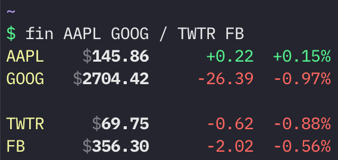

A simple program to get the price of stocks in your terminal.

Installation: `go get github.com/scastiel/fin`

Usage: `fin SYM1 SYM2 ...`

Add empty lines by using `/`.

Example: `fin AAPL GOOG / TWTR FB`

Stock data is fetched using the great package [github.com/piquette/finance-go/quote](https://pkg.go.dev/github.com/piquette/finance-go/quote).
